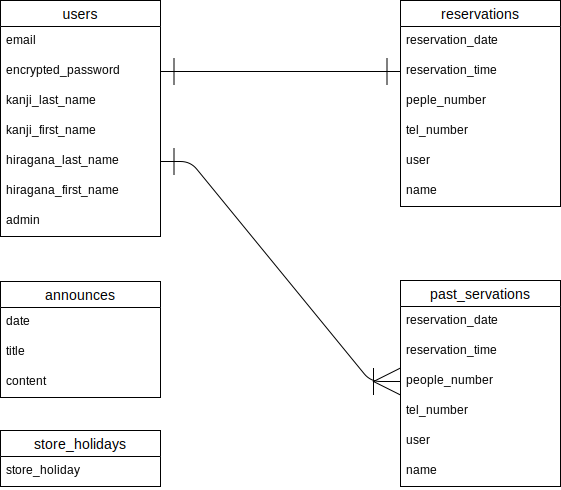

# アプリケーション名
 small-cafe app

# アプリケーション概要
実家で営んでいるカフェのホームページ兼予約システム

# URL
https://small-cafe.herokuapp.com/

# テスト用アカウント
- Basic認証ID:kenken
- Basic認証パスワード:1275
- 一般ユーザーメールアドレス：sample@sample
- 一般ユーザーパスワード：1sample
- 管理者メールアドレス：admin@smallcafe
- 管理者パスワード：admin0711

# 利用方法
## ホームページ機能
---
1.ユーザー新規登録をしなくても、ヘッダーの「店舗紹介」ボタンを押すと店舗紹介ページが閲覧できる 
2.ユーザー新規登録をしなくても、ヘッダーの「メニュー」ボタンを押すとメニューページが閲覧できる 
3.ユーザー新規登録をしなくても、トップページの新着情報欄のタイトルを押すとお知らせ詳細表示ページが閲覧できる
## 予約システム
---
1.ヘッダーからユーザー新規登録を行う 
2.ヘッダーから「予約する」ボタンを押し予約一覧（詳細）ページへ進む 
3.「新規予約する」ボタンを押し、新規予約ページへ進む 
4.必要事項を入力し、「予約確認画面へ」ボタンを押す 
5.予約確認画面で、内容に間違いが無いか確認し、「予約確定」ボタンを押す 
6.予約一覧(詳細)ページに戻るので、予約した内容と間違いが無いか確認する。

## 管理者 お知らせ機能
---
1.ヘッダーから管理者権限を持つアカウントでログインする。 
2.ヘッダーから「お知らせ一覧」ボタンを押しお知らせ一覧ページへ進む 
3.「新規投稿する」ボタンを押し、お知らせ新規投稿ページへ進む 
4.必要事項を入力し、「投稿する」ボタンを押すとお知らせ新規投稿ができる 
5.（ここからは一般ユーザーでも閲覧出来る）トップページの真ん中辺りの新着情報欄に投稿したお知らせのタイトルが表示されているか確認し、タイトルをクリックする 
6.お知らせ詳細ページに進み、投稿したお知らせの内容が表示される

## 管理者 予約管理機能
---
1.ヘッダーから管理者権限を持つアカウントでログインする。 
2.ヘッダーから「予約一覧」ボタンを押し予約一覧ページへ進む 
3.「新規予約する」ボタンを押すと新規予約ページへ、「過去の予約一覧」ボタンを押すと過去の予約一覧ページへ、予約があれば各予約の「予約ID」を押すと各予約の詳細表示ページへ進む。 
4.新規予約ページへ進んだ場合、必要事項(お名前は任意)を入力し「予約確認画面へ」ボタンを押すと予約確認画面へ進む 
5.予約確認画面で、内容に間違いが無いか確認し、「予約確定」ボタンを押す 
6.予約一覧ページへ戻るので、予約した内容と間違いが無いか確認する。 
7.予約一覧ページから過去の予約一覧ページへ進んだ場合、前営業日までの過去の予約一覧を確認でき、キーワードもしくは日付検索(両方でも可能)が出来る 
8.過去の予約一覧ページから、各予約のIDをクリックすると過去の予約内容詳細ページへ進み、詳細内容を確認できる 
9.予約一覧ページから各予約の詳細表示ページへ進んだ場合、各予約の詳細内容を確認出来、「キャンセルする」ボタンが表示される 
10.「キャンセルする」ボタンを押すと、キャンセル確認画面へ進むので、内容に間違いが無いか確認し、「予約確定」ボタンを押す
11.予約がキャンセルされ、予約一覧ページに戻るので、キャンセルした予約が表示されていないか確認する。

# アプリケーションを作成した背景
実家で母が営んでいるカフェがあるが、このホームページが無く、予約も母が手書きで管理しているため、アプリで一括管理出来ると便利と考え、開発することにした。急遽休業日にする事もあるため、お知らせ機能を実装することで、お客様にも周知出来ると考えた。

# 洗い出した要件
[要件を定義したシート](https://docs.google.com/spreadsheets/d/192NWSSbbQrXc_r4btVg9X5TLHclcEeQ6nKYos-nFU08/edit#gid=982722306)

# 実装した機能についての画像やGIF及びその説明
- ユーザー管理機能

- 予約機能(過去の日付と定休日は選択できず、また既に予約が入っている場合はそれを考慮し、選択肢が表示されないようになる)

- 予約機能(予約確認画面を挟み、確定するボタンを押すと保存され予約一覧（詳細）ページに戻る)

- 管理者機能(管理者権限を持つアカウントでログインした場合、ヘッダーの内容が変わる)

- 管理者機能(管理者はお知らせ機能を利用出来、新規投稿・編集・削除が出来る)

- お知らせ機能(投稿されたお知らせは、トップページ新着情報欄に表示されるタイトルから詳細を閲覧出来る)

- 管理者機能(管理者は、現在の予約一覧を確認出来、全ての予約をキャンセル出来る権限を持つ)

- 管理者機能(管理者は、過去の予約一覧を確認出来る。検索で絞り込むことも可)

# 実装予定の機能
- ワークショップ開催の応募フォーム作成
- スマートフォンやタブレットで開いた際の要素のサイズ変更
- メニューやトップページのコンテンツの充実化

# データベース設計

## usersテーブル

| Column              | Type   | Options                 |
| ------------------- | ------ | ----------------------- |
| email               | string | null: false,unique:true |
| encrypted_password  | string | null: false             |
| kanji_last_name     | string | null: false             |
| kanji_first_name    | string | null: false             |
| hiragana_last_name  | string | null: false             |
| hiragana_first_name | string | null: false             |

### Association
- has_one :reservation
- has_many :past_reservations

## reservationsテーブル

| Column           | Type       | Options                      |
| ---------------- | ---------- | ---------------------------- |
| reservation_date | date       | null: false                  |
| reservation_time | integer    | null: false                  |
| people_number    | integer    | null: false                  |
| tel_number       | string     | null: false                  |
| user             | references | null: false,foreign_key:true |
| name             | string     |                              |

### Association
- belongs_to :user

## past_reservationsテーブル

| Column           | Type       | Options                      |
| ---------------- | ---------- | ---------------------------- |
| reservation_date | date       | null: false                  |
| reservation_time | integer    | null: false                  |
| people_number    | integer    | null: false                  |
| tel_number       | string     | null: false                  |
| user             | references | null: false,foreign_key:true |
| name             | string     |                              |

### Association
- belongs_to :user

## announcesテーブル

| Column  | Type   | Options     |
| ------- | ------ | ----------- |
| date    | date   | null: false |
| title   | string | null: false |
| content | text   | null: false |

## store_holidaysテーブル
| Column        | Type   | Options                 |
| ------------- | ------ | ----------------------- |
| store_holiday | date   | null: false,unique:true |

# ER図

# 画面遷移図

# 開発環境
- フロントエンド：HTML・CSS・JavaScript
- バックエンド：Ruby・Ruby on Rails
- インフラ：heroku・messaging-api
- テスト：Rspec
- テキストエディタ：Visual Studio Code
- タスク管理：GitHub

# ローカルでの動作方法
以下のコマンドを順に実行 
% git clone https://github.com/kenken-1275/small-cafe 
% cd small-cafe 
% bundle install 
% yarn install

# 工夫したポイント
- 予約機能の新規予約画面において、営業曜日のみ現在の予約状況を表示するカレンダーの表示を実装した点 
gemのsimple_calendarを利用したが、週で表示する場合、そのままでは全ての曜日が表示されてしまうので、インストールしたコードの解析を行い、どこをどのように変更・追記するとどう変わるという試行錯誤を繰り返し実装に辿り着いた。

- 同じく新規予約画面において、過去の日付と定休日は選択出来ないようにし、また既に予約が入っている日付・時間帯に関してはその人数を考慮し、満員(１つの時間帯で3人まで)であればその時間帯の選択肢を表示しないようにし、まだ空きがある状態であれば予約可能人数(3 - 現予約人数)のみ選択肢を表示させるようにした点。 
JavaScriptの非同期通信で実現しており、コントローラーで日付・時間帯別で予約人数を合計して取得し、人数の選択肢除外の場合はそのまま送信、時間帯の選択肢除外の場合は3人未満かどうかをTrue or Falseで送信し、JavaScript内で処理することで実現しました。

- 予約機能において、予約日時が過去の日付になった時点で自動的にpast_reservationsテーブルにアーカイブされるようにした点。 
reservationsテーブルの前日の予約情報を取得し、past_reservationsテーブルに保存した後、reservationsテーブルではその内容を削除する、というrake_taskを作成し、cronを利用して毎日深夜1:00に実行されるようにした。